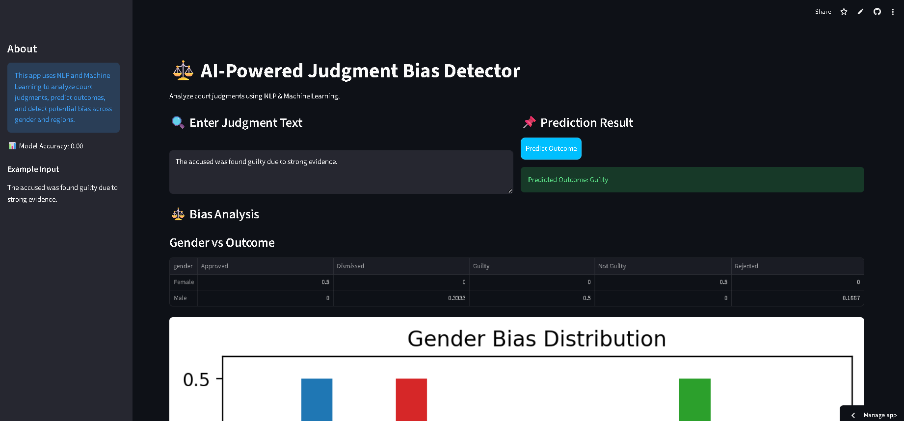

# ⚖️ Judgment Bias Detector

An AI-powered web application that analyzes court judgments and detects potential **bias patterns** using Natural Language Processing (NLP) and Machine Learning.

---

## 🚀 Live Demo

🔗 https://judgment-bias-detector-c8wtvt49uxakhbqtejetj6.streamlit.app/

---

## 📌 Features

* 🔍 Predicts case outcome (Guilty / Not Guilty)
* ⚖️ Analyzes potential bias based on gender and region
* 📊 Visualizes bias trends using charts
* 📂 Includes sample dataset for demo
* ⚡ Interactive UI built with Streamlit

---

## 🛠️ Tech Stack

* Python
* Pandas
* NumPy
* Scikit-learn
* NLTK
* Streamlit
* Matplotlib

---

## 📂 Project Structure

```
judgment-bias-detector/
│
├── app/
│   └── streamlit_app.py
│
├── data/
│   └── sample_judgments.csv   # small demo dataset ✅
│
├── src/
├── requirements.txt
└── README.md
```

---

## ⚙️ Installation & Setup

### 1️⃣ Clone the repository

```
git clone https://github.com/Shrishti1701/judgment-bias-detector.git
cd judgment-bias-detector
```

### 2️⃣ Create virtual environment

```
python -m venv venv
```

### 3️⃣ Activate environment

```
venv\Scripts\activate
```

### 4️⃣ Install dependencies

```
pip install -r requirements.txt
```

### 5️⃣ Run the app

```
streamlit run app/streamlit_app.py
```

---

## 📊 Dataset

* Includes a **sample dataset (`sample_judgments.csv`)** for demonstration
* You can replace it with real court judgment datasets for better results

---

## 🧠 Model Details

* Text preprocessing using NLTK
* Feature extraction using TF-IDF
* Classification using Logistic Regression
* Bias detection using grouped statistical analysis

---

## 📸 Screenshots

*Add your app screenshots here*




---

## 🎯 Future Improvements

* Advanced NLP models (BERT / Transformers)
* More bias dimensions (caste, socioeconomic factors)
* Real-time legal data integration
* Model explainability (SHAP/LIME)

---

## ⚠️ Disclaimer

This project is for educational purposes only and does not represent real legal judgments.

---

## 📧 Contact

**Shrishti Banshiar**
GitHub: https://github.com/Shrishti1701

---

## ⭐ Support

If you like this project, give it a ⭐ on GitHub!
